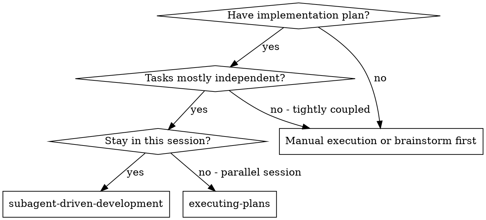

# Subagent-Driven Development

Execute plan by dispatching fresh subagent per task, with two-stage review after each: spec compliance review first, then code quality review.

**Why subagents:** Fresh context per task, no context pollution, preserves your own context for coordination.

**Core principle:** Fresh subagent per task + two-stage review (spec then quality) = high quality, fast iteration

**Continuous execution:** Do not pause to check in between tasks. Execute all tasks without stopping unless BLOCKED or all tasks complete.

## When to Use

## The Process

For each task:
1. Dispatch implementer subagent with full task text + context
2. Answer any questions before letting them proceed
3. Implementer implements, tests, commits, self-reviews
4. Dispatch spec compliance reviewer — confirms code matches spec
5. If spec issues found: implementer fixes, re-review
6. Dispatch code quality reviewer — approves or requests fixes
7. If quality issues found: implementer fixes, re-review
8. Mark task complete, move to next

After all tasks: dispatch final code reviewer, then use `finishing-a-development-branch`.

## Model Selection

- Mechanical tasks (1-2 files, clear spec): cheap/fast model
- Integration tasks (multi-file): standard model
- Architecture/review tasks: most capable model

## Handling Implementer Status

- **DONE:** Proceed to spec compliance review
- **DONE_WITH_CONCERNS:** Read concerns, address if about correctness, then review
- **NEEDS_CONTEXT:** Provide missing context and re-dispatch
- **BLOCKED:** Assess blocker — provide context, upgrade model, break task, or escalate

## Red Flags

**Never:**
- Start on main/master without explicit user consent
- Skip spec compliance review OR code quality review
- Dispatch multiple implementation subagents in parallel
- Make subagent read plan file (provide full text instead)
- Accept "close enough" on spec compliance
- Start code quality review before spec compliance is ✅
- Move to next task while either review has open issues

## Integration

**Required workflow skills:**
- `using-git-worktrees` - Isolated workspace
- `writing-plans` - Creates the plan this skill executes
- `requesting-code-review` - Code review template
- `finishing-a-development-branch` - Complete after all tasks

**Subagents should use:**
- `test-driven-development` - TDD for each task
